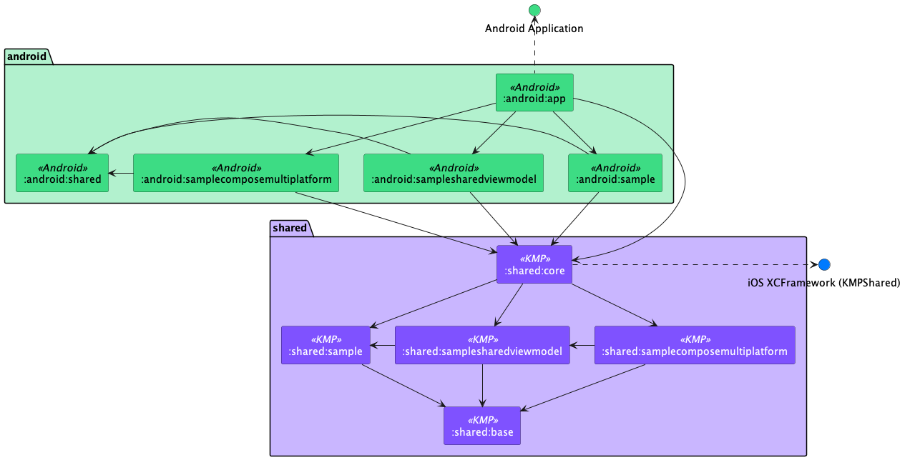

# Matee KMP DevStack

## Use Devstack as a base for a new project

- Use this repository as a template when creating a new repository for your project
- Rename the project (don't forget to change `rootProject.name` in `settings.gradle` and `id`
  and `AppName` in `Application.kt`)
- Rename iOS project - you can use prepared script, for more info see
  the [iOS readme](./ios/README.md)

## About

This repo contains our template for multiplatform mobile project. Both Android and iOS
implementations
are present with shared modules containing all common business logic organized in Clean
architecture.  
The project contains three sample screens:

- one with **native UI** and **native view model** (for Android Compose UI and view model in Kotlin,
  for iOS
  SwiftUI and view model in Swift)
- second one with **native** (Compose and SwiftUI) **UI** and **shared view model**
- and the third one with **shared Compose Multiplatform UI** and **shared view model**

## Architecture

Clean (common modules) + MVVM (platform-specific modules) architecture is used for its testability
and ease of *modularization*.
Code is divided into several layers:

- infrastructure (`Source`)
- data (`Repository`)
- domain (`UseCase`)

### Shared

Shared modules in general handle networking, persistence and contain UseCases which bridge platform
specific code with common code.

There is `:shared:core` that combines feature modules and core and generates `XCFramework` for iOS
and is the main module imported in android modules.

`:shared:base` is a module containing all the base and common classes needed in feature modules.

Structure inside each module is organized with Clean architecture in mind to several layers of
abstraction where everything in domain or data layer is marked as `internal` to prevent confusion.

> The whole project relies heavily on dependency injection

### Android

Android code is separated into several feature-modules with `android:app` module providing
navigation root and `android:shared` module containing shared android code like common components or
values. Following standards the Android-specific modules use MVVM architecture where ViewModels use
UseCases as gateway to shared *model* layer (in case you use native view models).

### iOS

- More info in the [iOS readme](./ios/README.md)

## Sharing options

As mentioned above, there are three options for how much code you want to share between platforms.

### Native UI and view models

If you choose not to share view models neither UI, you can go ahead and
delete `samplesharedviewmodels` and `samplecomposemultiplatform` modules in both `shared`
and `android` and create own repositories, use cases, sources, ... according to what you find in
the `:shared:sample` module and UI and view models according to `:android:sample`. You can also
remove compose multiplatform plugin from `libs.versions.toml`.

### Native UI and shared view models

If you choose to share view models, but use native UI, you can delete
the `samplecomposemultiplatform` module in both `shared`and `android`. You can also remove compose
multiplatform plugin from `libs.versions.toml`.Refactor base classes that you will need:
move `samplesharedviewmodel/base` files in `:shared:samplesharedviewmodel` to the `:shared:base`
module (from `commonMain` as well as `iosMain` and `androidMain`) to have base classes you can
extend. Also in iOS project move `SampleSharedViewModel/Toolkit` to `UIToolkit`. Then you can write
your shared view models in the same way as the `SampleSharedViewModel` is written and used (
especially check the usage on iOS with helpful extension methods).

### Shared UI and view models

If you go all out and decide to share both UI and view models, take inspiration
from `SampleComposeMultiplatformScreenViewController` when calling you view from the swift code. For
Android there are no changes needed, see in `:android:samplecomposemultiplatform` for yourself.

## Creating new feature module in shared

- Create a new module and copy `build.gradle.kts` content from one of the existing modules, change
  `namespace` and dependencies on other modules as needed
- Add dependency to `settings.gradle.kts`, `build.gradle.kts` of `:shared:core` and `.kmm()`
  in `KmmConfig` in `build-logic`
- Add DI module to `Module` in `:shared:core`

## Technologies

### DI

#### Android - Koin

Koin supports Kotlin Multiplatform and it's pure Kotlin project. Each module
(including all Android feature modules) has it's own Koin module. All modules (including common
module) are put together inside platform specific code where Koin is initialized.

#### iOS - Factory

We are using DI library Factory.

### Networking - Ktor

Accessing network is usually the most used IO operation for mobile apps so Ktor was used for it's
simple and extensible API and because it's multiplatform capable with different engines for each
platform.

### Resources

#### Twine

All strings in the application are localized and shared with the iOS team
via [Twine](https://github.com/scelis/twine). Strings are stored in the `twine/strings.txt` file.
TwinePlugin then generates appropriate `strings.xml` files from the mentioned `strings.txt` file.
When modifying `strings.txt` it is required to comply with the specified syntax and to pull/push all
the changes frequently

#### Moko

Error messages are shared via [Moko Resources](https://github.com/icerockdev/moko-resources), so
that we can use the strings in the shared code and avoid duplicities when converting errors to
string messages. Error strings are stored in the `twine/errors.txt` file. Gradle task
`generateErrorsTwine` first generates `strings.xml` files from `errors.txt` and then gradle task
`generateMRCommonMain` generates `MR` class that can be used in the common code.

### UI - Jetpack Compose

#### Android

**Jetpack Compose** is the go to for Android UI nowadays.

#### iOS

We recommend going with **SwiftUI**, unless you want to for some views or screens use Compose
Multiplatform (below)

#### Shared

**Compose Multiplatform** (from Jetbrains) is still young, but you can try it out and for some
simple screens (or maybe whole simple projects) it might be the right choice. It can save a lot of
time since each view will be written only once and used on both platforms.

### iOS

- More info in the [iOS readme](./ios/README.md)
